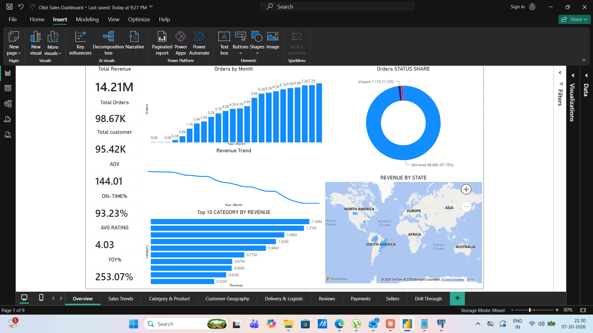
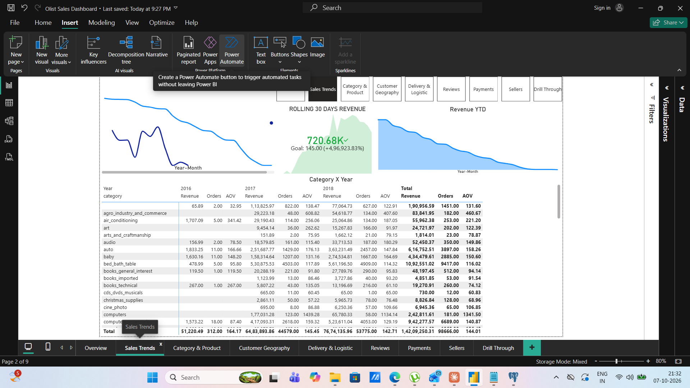
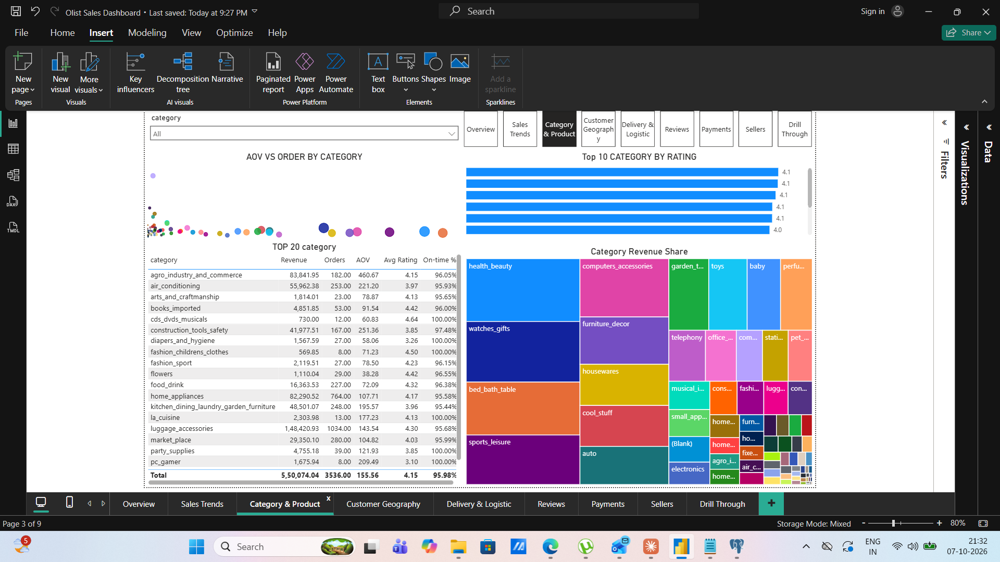
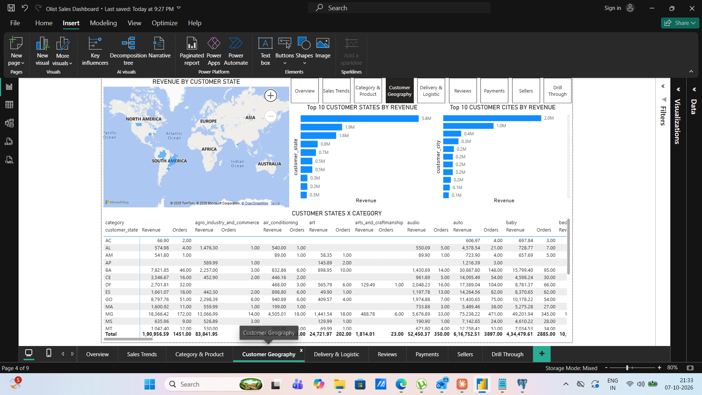
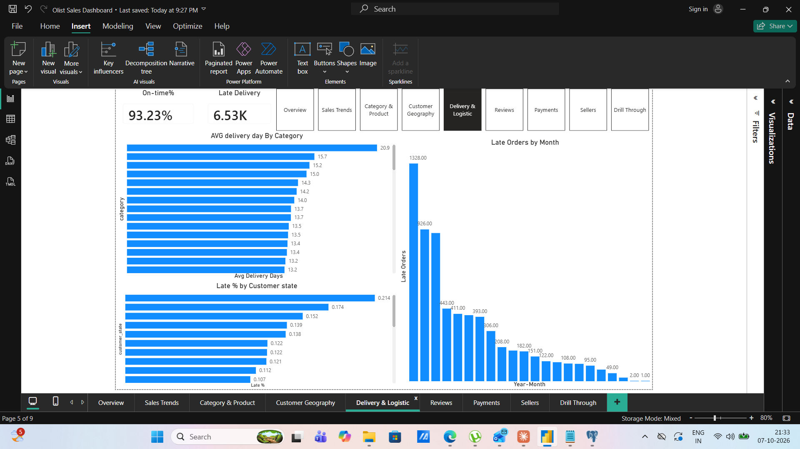
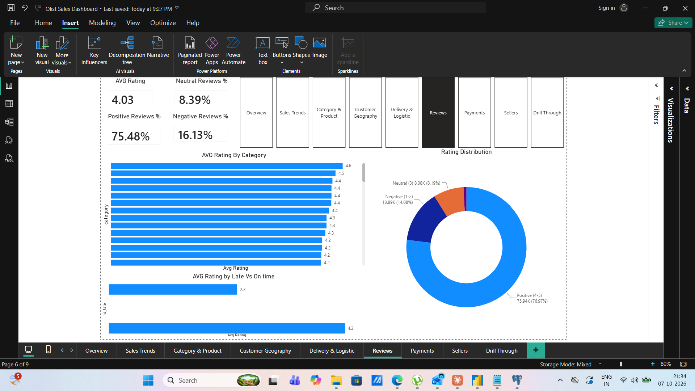
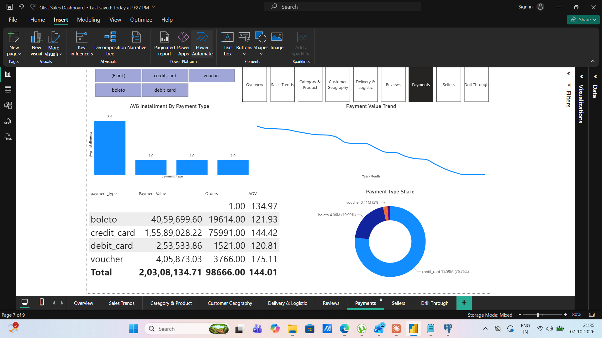
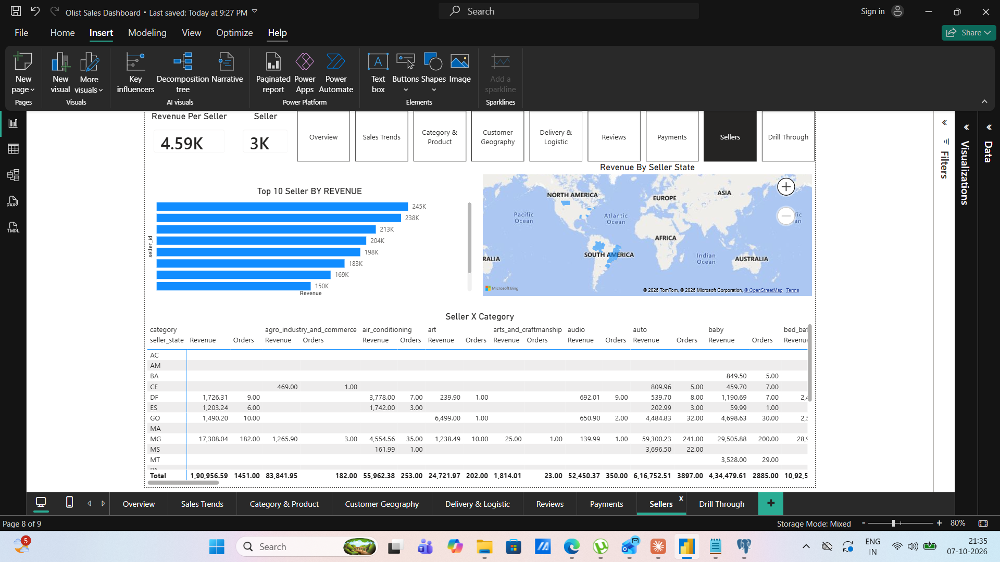
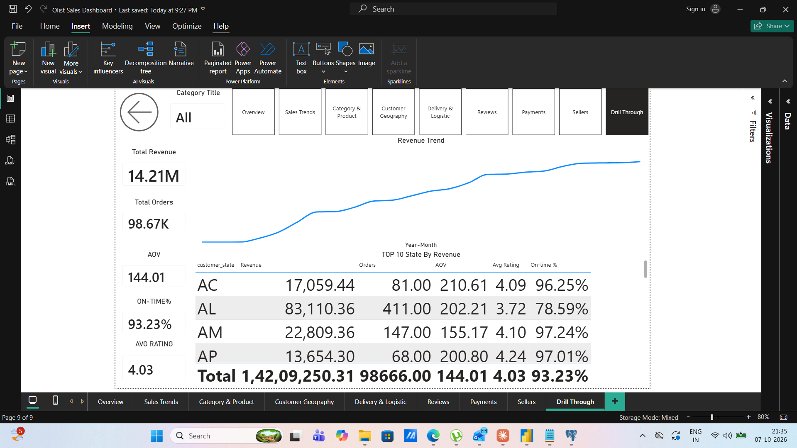

# Olist E-Commerce Sales Dashboard

An end-to-end BI project on the Brazilian Olist e-commerce dataset, using PostgreSQL for data modeling and Power BI for reporting.

## Tools
PostgreSQL · Power BI (Mixed / DirectQuery) · DAX · SQL

## Business Questions
- How are revenue, orders and AOV trending over time?
- Which categories, states and sellers drive revenue?
- How reliable is delivery, and how does lateness affect reviews?
- How do customers pay?

## Dashboard Pages

### Overview

### Sales Trends

### Category & Product

### Customer Geography

### Delivery & Logistics

### Reviews

### Payments

### Sellers

### Drill Through

## Repository Structure
- `dashboard/` – Power BI report (.pbix)
- `images/` – dashboard screenshots
- `sql/` – table creation, indexes and BI views
- `dax/` – DAX measures and date table
- `docs/` – report page and visual specification

## Data Model
Raw tables → BI views (`bi_dim_product`, `bi_fact_order`, `bi_fact_review_latest`, `bi_fact_sales`, `bi_payments_order`) → DAX date table and measures in Power BI.

## How to Reproduce
1. Download the dataset from Kaggle: "Brazilian E-Commerce Public Dataset by Olist".
2. Run the table creation script in `sql/` (update the CSV paths in the `COPY` commands).
3. Run the index script, then the BI views script.
4. Open the `.pbix` in `dashboard/` and point it to your PostgreSQL database.
5. Create the date table from `dax/DateDim.txt` and add the measures from `dax/DAX_Measures.txt`.

## Key Metrics
Revenue, GMV, Orders, Customers, AOV, On-time %, Avg Rating, YoY %, Rolling 30D Revenue, Revenue per Seller

## Note
The report is connected to a local PostgreSQL database, so the .pbix will not refresh without your own copy of the data. The screenshots above show the full dashboard.

